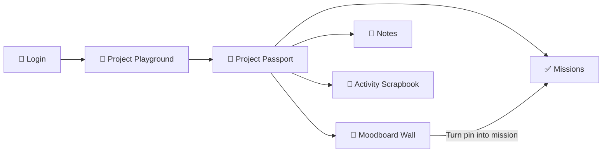

<div align="center">

# ✦ LOOP CLUB ✦

### **A playful creative workspace for projects, missions, moodboards and beautifully unfinished ideas.**

<p>
  
  
  
  
</p>

```text
╭──────────────────────────────────────────────────────────────╮
│  MAKE IT WEIRD.  MAKE IT USEFUL.  THEN SHIP THE THING. ✦    │
╰──────────────────────────────────────────────────────────────╯
```

</div>

---

## 🟧 What is Loop Club?

**Loop Club** is a browser-based creative project playground built for people who have:

- ideas everywhere
- seventeen tabs open
- unfinished projects with excellent potential
- moodboards that deserve to become actual work
- a strong dislike of boring productivity dashboards

It combines a **Project Playground**, **Project Passport**, **Mission System**, and a draggable **Moodboard Wall** into one bright little creative operating system.

> **Not another grey dashboard. Not another purple glass card.**  
> This one has stickers, stamps, crooked cards, sharp borders and actual personality.

---

## 🎟️ The Journey



---

## 🧩 Main Features

<table>
<tr>
<td width="50%">

### 🎪 Project Playground

- Create, edit and delete projects
- Filter by project status
- Give every project a personality
- Flip project cards for hidden details
- See deadlines, warnings and progress
- Track recent activity
- Pick a **Today's Tiny Move**

</td>
<td width="50%">

### 📒 Project Passport

- Overview
- Missions
- Moodboard preview
- Notes
- History
- Automatic progress
- Milestone celebrations
- Creative rescue button

</td>
</tr>
<tr>
<td width="50%">

### ✅ Mission System

- Add clear, finishable project tasks
- Mark one as today's focus
- Edit and remove missions
- Calculate progress automatically
- Turn inspiration into action
- Celebrate 25%, 50%, 75% and 100%

</td>
<td width="50%">

### 🧷 Moodboard Wall

- Drag pins around
- Resize and rotate cards
- Bring pins forward
- Lock positions
- Highlight important references
- Turn any pin into a project mission
- Tidy the whole wall automatically

</td>
</tr>
</table>

---

## 🌈 Moodboard Pin Types

| Pin | What it is for |
|---|---|
| 📝 **Note** | Loose ideas, reminders and sparks |
| 🎨 **Colour** | Palette choices and visual direction |
| 🖼️ **Image** | Visual references using public image URLs |
| 🔗 **Link** | Inspiration pages and useful references |
| 💬 **Quote** | Tone, voice and creative direction |
| 🔤 **Font** | Typography choices and font experiments |
| ⚙️ **Feature** | Product ideas ready to become missions |
| 🔒 **Decision** | Final choices stamped **LOCKED IN ✓** |

---

## 🎭 Project Personalities

Every project gets a little costume:

```text
⚡ Loud & Experimental
🌿 Calm & Minimal
🎬 Cinematic
🧃 Playful
🧠 Technical
```

The personality changes the project card's visual styling while keeping the same overall Loop Club identity.

---

## ✨ Tiny Details That Make It Feel Alive

- Project cards straighten on hover
- Buttons physically press down
- New work gets a `NEW!` sticker
- Finished projects receive a `SHIPPED` stamp
- Approaching deadlines get warning tickets
- Moodboard cards can overlap like real paper
- Decision cards receive a **LOCKED IN** stamp
- Milestones trigger confetti
- Footer messages rotate automatically
- Empty states have personality
- The **I'm Stuck** button gives one useful next move

```text
╔══════════════════════════════════════════════╗
║  SMALL STEPS. LOUD IDEAS.                   ║
║  PERFECT IS NOT INVITED.                    ║
║  PIN THE FEELING. BUILD THE THING.          ║
╚══════════════════════════════════════════════╝
```

---

## 🗂️ Project Structure

```text
loop-club-complete/
│
├── index.html          # Login and local membership
├── projects.html       # Project Playground
├── project.html        # Project Passport
├── moodboard.html      # Full Moodboard Wall
│
├── styles.css          # Shared visual system
├── storage.js          # Shared localStorage data layer
├── projects.js         # Playground logic
├── project.js          # Passport and missions logic
├── moodboard.js        # Moodboard interactions
│
└── README.md           # You are here ✦
```

---

## 🚀 Run It Locally

### 1. Download or clone the project

```bash
git clone https://github.com/kutty04/Playground.git
```

Or download the ZIP and extract it.

### 2. Keep all files together

Do not move the JavaScript or CSS files into separate folders unless you also update their paths.

### 3. Open the app

Double-click:

```text
index.html
```

Chrome, Edge or Firefox will work.

### 4. Create a membership

Click **Create your membership**, enter an email and password, then log in.

You will be redirected to:

```text
projects.html
```

---

## 🎮 How to Use It

### Create a project

1. Click **Start a new project**
2. Add a name and description
3. Choose its status and deadline
4. Add technology tags
5. Choose its personality
6. Save it

### Make progress real

Open a project and add missions:

```text
✓ Choose final palette
✓ Design login screen
□ Build mobile navigation
□ Test every button
```

Progress is calculated from completed missions:

```text
3 completed missions ÷ 4 total missions = 75%
```

### Build a moodboard

Add pins, drag them around, resize them and overlap them.

Click the ✓ button on a pin to turn it into a mission.

---

## 🏁 Milestone Messages

| Progress | Message |
|---:|---|
| **25%** | The idea has legs. |
| **50%** | Halfway through the beautiful chaos. |
| **75%** | Polish mode unlocked. |
| **100%** | SHIP IT. |

---

## 🛠️ Built With

<p>
  
  
  
  
</p>

No framework. No build step. No dependency maze. Just browser-native HTML, CSS and JavaScript.

---

## 💾 Data Storage

Loop Club stores data inside your browser using `localStorage`.

Saved data includes:

- users
- current login session
- projects
- missions
- project notes
- moodboard pins
- activity history

You can inspect it in Chrome:

```text
F12 → Application → Local Storage
```

---

## ⚠️ Important Security Note

This project uses localStorage authentication for learning and frontend demonstrations.

Passwords stored in localStorage can be viewed through browser developer tools.

> **Do not use this authentication system for a real public product.**

For production, connect the same interface to:

- Supabase Authentication
- Firebase Authentication
- Clerk
- Auth0
- A secure custom backend

---

## 🧪 Reset the Demo

To remove all saved Loop Club data:

1. Open Developer Tools with `F12`
2. Go to **Application**
3. Open **Local Storage**
4. Select the current page
5. Click **Clear**

Then refresh `index.html`.

---

## 🧃 Design Language

Loop Club follows a bold editorial visual system:

```text
INK      #171717
CREAM    #F7F1E7
PAPER    #FFFDF8
ORANGE   #FF6038
YELLOW   #FFD84D
PINK     #FF8FA3
BLUE     #3155FF
MINT     #9BE8C7
```

The core rules:

- thick black borders
- hard offset shadows
- warm paper backgrounds
- oversized serif typography
- asymmetrical composition
- sticker-style controls
- playful motion with useful purpose

---

## 🗺️ Future Ideas

- Export and import project data
- Real image uploads
- Cloud sync
- Team collaboration
- Project templates
- Calendar view
- Search across all projects
- Keyboard shortcuts
- Light and dark print-inspired themes
- Supabase backend

---

## 🤝 Contributing

Contributions are welcome.

A good contribution should be:

```text
USEFUL  +  CLEAR  +  A LITTLE UNEXPECTED
```

Suggested workflow:

```bash
git checkout -b feature/your-idea
git commit -m "Add your useful idea"
git push origin feature/your-idea
```

Then open a pull request.

---

## 📜 License

This project is currently intended for learning, experimentation and portfolio use.

Add your preferred open-source license before publishing it as a reusable public project.

---

<div align="center">

## ✦ Welcome to the club. ✦

**Build the strange little thing. Give it a proper home. Finish one mission today.**

```text
       ◢██████◣
    ◢██◤      ◥██◣
   ██◤   LOOP   ◥██
   ██    CLUB    ██
   ██◣          ◢██
    ◥██◣      ◢██◤
       ◥██████◤
```


</div>
